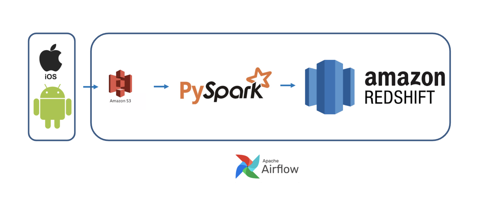

# ongo

Insight Data Engineering Fellowship Project Boston 2020C Session

| ->  [Demo](https://www.dataprocessin.me)        |                ->  [Slides](https://docs.google.com/presentation/d/1CYs-kQxClCcqrtwxzhvuaeGHFhIe7-M5OvJaO7CI4nE/edit#slide=id.ga03775e1c2_2_61)           |
| ------------- |:-------------:|

## 1. Motivation

Ongo is a platform that enables experts in the health & wellness space to launch data-driven consumer apps. For instance, if you are a yoga teacher or a fitness trainer, Ongo is a great choice for you since you don't have to hire a development team to build your own app. You may simply customize your own app with basic and premium features from Ongo platform. You may also manage access to your content with subscription features—built into the app and own your community.

*Own your community and engage: Build a supportive network of members to answer questions and motivate each other!

*Deliver high quality interactive programs: Easily build modular programs that adapt around your users and collect real outcomes data!

*Get your own app fast and easy: One-stop shop to launch your app and always keep it fresh—plus, robust analytics help you always be your best!

Connect with your members, wherever they are!
Trusted by your users!

## 2. Pipeline

__Figure 1.__ Pipeline depicting the flow of data.

## 3. Requirements
- Python3
- [AWS CLI](https://aws.amazon.com/cli/)
- [boto3](https://boto3.amazonaws.com/v1/documentation/api/latest/guide/quickstart.html#installation)

## 4. Architechture

### Spark

4 EC2 m5ad.2xlarge instances (1 master 3 slaves spark cluster)

[Installation](https://blog.insightdatascience.com/simply-install-spark-cluster-mode-341843a52b88)

### Airflow

1 EC2 m5ad.xlarge instance

[Installation](https://blog.insightdatascience.com/scheduling-spark-jobs-with-airflow-4c66f3144660)

### Redshift

1 EC2 m5ad.xlarge instance

[Installation](https://docs.aws.amazon.com/redshift/latest/gsg/getting-started.html)

## 5. DataSet
Ongo data set

## 6. Methodology

### Data Collection:

Original data is stored on s3 as in json format

etl_iso.py: Loads the data files from iso system from s3, convert to spark sql fromat and load into Amazon redshift.

etl_android.py: Loads the data files from android system from s3 to Amazon redshift.

etl_tre.py: Loads the data files in an old app on iso system from s3 to Amazon redshift.

## 8. Dashboard

__Figure 4.__ Dashboard showing a comparative analysis of the metrics associated with different technologies. It also shows the other tags frequently occuring with these tags

## 9. Getting Started

Post installation of all the components of the pipeline, it can be used in two ways:
### 1. Initialize the Dag in Airflow and launch it on airflow scheduler:

` cp /home/ubuntu/stackInsight/src/airflow/de_dag.py /home/ubuntu/airflow/de_dag.py`
 
` python de_dag.py`
  
### 2. Run the following scripts:

./data_collection.sh

